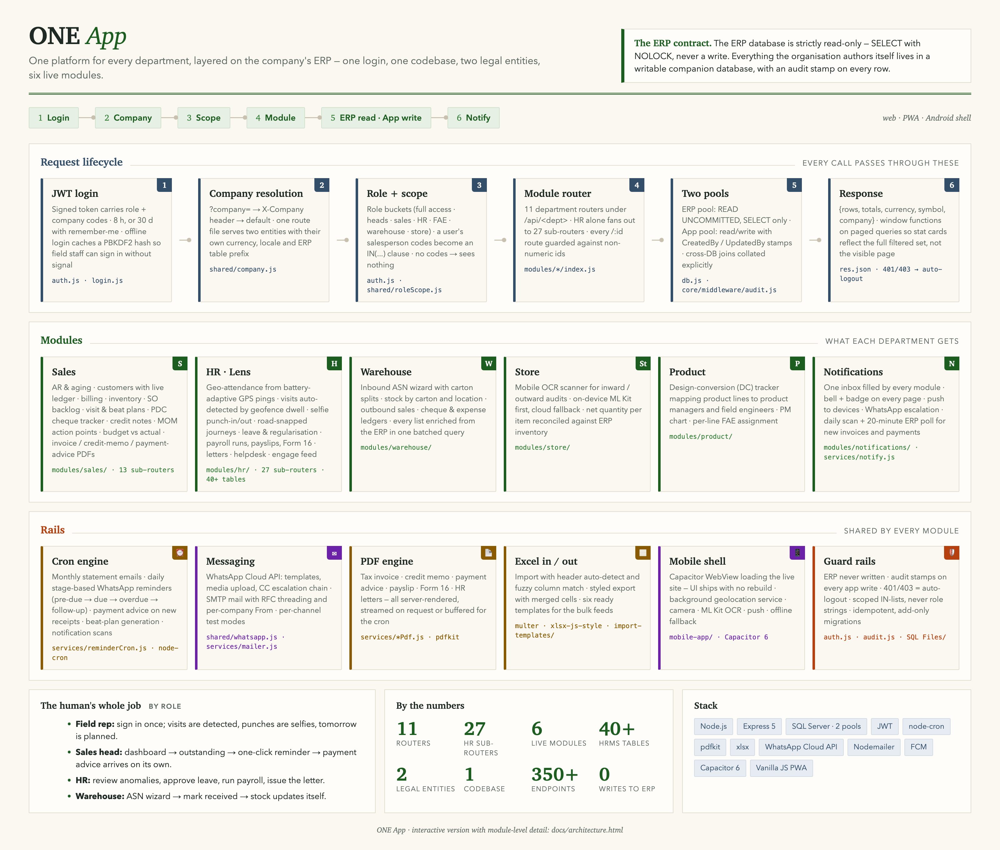

# ONE App

One platform for every department, layered on the company's ERP. One login, one codebase, two legal entities, six live modules, and a thin Android shell for the field.

Built and run in production for a two-entity electronics distributor (India and Singapore). Company identity, credentials, seed users and ERP connection details are replaced with placeholders in this copy; the code is otherwise as deployed.



> **The ERP contract.** The ERP database is strictly read-only: `SELECT` with `NOLOCK`, never a write. Everything the organisation authors itself lives in a writable companion database, with an audit stamp on every row.

Interactive version with module-level detail: [docs/architecture.html](docs/architecture.html).

## By the numbers

| | |
|---|---|
| Lines of code | ~83,000 across ~450 files |
| JavaScript | ~58,000 lines, 167 files |
| API endpoints | 350+ across 11 department routers |
| HR alone | 27 sub-routers, 40+ tables |
| Schema | 98 migration files, idempotent and add-only |
| Frontend | 66 pages, vanilla JS PWA, no framework |
| Documents | 6 server-rendered PDF types |
| Entities | 2 companies, 2 currencies, 1 route file each |

## What each department gets

| Module | Surface |
|---|---|
| **Sales** | AR and aging, customers with a live detailed ledger, billing with FIFO cost, inventory, SO backlog, visit and beat plans, PDC cheque tracker, credit notes, MOM action points, budget vs actual, invoice / credit-memo / payment-advice PDFs |
| **HR · Lens** | Geo-attendance from battery-adaptive GPS pings, visits auto-detected by geofence dwell, selfie punch-in/out, road-snapped journeys, anomalies, leave and regularisation, employee profiles, payroll runs and payslips, IT declaration, Form 16, letters, helpdesk, engage feed, documents |
| **Warehouse** | Inbound ASN wizard with carton splits, stock by carton and location, outbound sales, cheque and expense ledgers, one batched ERP enrichment on every list |
| **Store** | Mobile OCR audit scanner (on-device ML Kit first, cloud fallback) reconciled against ERP inventory |
| **Product** | Design-conversion tracker mapping product lines to product managers and field engineers |
| **Notifications** | One inbox filled by every module, bell and badge on every page, push to devices, WhatsApp escalation, daily scan plus a 20-minute ERP poll |

Placeholder routers exist for CSR, Accounts, Purchase, Workflow, Common and FAE.

## How a request moves

1. **JWT login.** The token carries role and company codes. Remember-me issues 30 days, otherwise 8 hours. Offline login caches a PBKDF2 hash so a field rep with no signal can still sign in.
2. **Company resolution.** `?company=` → `X-Company` header → default. A single config map holds each entity's ERP table prefix, currency and locale, and the prefix is spliced into table names, which is what lets one route file serve both companies.
3. **Role and scope.** Role buckets plus attribute scoping: a user's salesperson codes become an `IN (...)` clause. Full access gets no clause. No codes means no rows.
4. **Module router.** Express 5, eleven routers under `/api/<dept>`. Every `/:id` route is guarded against non-numeric ids and literal paths are declared first.
5. **Two pools.** The ERP pool wraps every query in `READ UNCOMMITTED`. The app pool is read/write with `CreatedBy` / `UpdatedBy` stamps.
6. **Response.** Paged queries carry `COUNT(*) OVER()` and `SUM(...) OVER()` so stat cards reflect the full filtered set, not the visible page.

## Rails shared by every module

- **Cron engine.** Monthly statement emails, daily stage-based WhatsApp reminders (pre-due → due → overdue → follow-up), payment advice on new receipts, beat-plan generation, notification scans. Per-channel test modes write synthetic ids that stats exclude.
- **Messaging.** WhatsApp Cloud API direct (templates, media upload, CC escalation chain, phone normalisers) and SMTP mail with RFC threading and a per-company From.
- **PDF engine.** Tax invoice, credit memo, payment advice, payslip, Form 16, HR letters, all rendered with pdfkit and either streamed on request or buffered for the cron.
- **Excel in / out.** Import auto-detects the header row and fuzzy-matches columns; export renders merged cells. Six templates in `import-templates/`.
- **Mobile shell.** Capacitor 6 WebView loading the live site, so UI changes ship with no APK rebuild. Background geolocation as a foreground service, camera, ML Kit OCR, push.
- **Guard rails.** ERP never written. Audit stamps on every app write. 401 and 403 both log the user out. Migrations are idempotent and add-only, and columns added later are detected at query time so a partially migrated database does not crash.

## Repository layout

```
backend/            Express 5 server, auth, two DB pools, department modules, services
  modules/<dept>/   index.js mounts routes/*.js; hr/ also has services/ (detectors)
  services/         cron, mailer, PDF renderers, tax engine, notify
  shared/           company config, WhatsApp client, role scoping, geofence
frontend/           vanilla JS PWA: shared/ bootstrap + modules/<dept>/ pages
mobile-app/         Capacitor 6 Android shell
SQL Files/          app-database migrations (root chain + hr/ + reminder/), run manually
import-templates/   Excel templates for the bulk feeds
deploy/             PowerShell deploy with backup, node --check and dry-run
docs/               architecture diagram (static PNG source + interactive HTML)
```

## Running it

```bash
cd backend
cp ../.env.example .env      # fill DB_SERVER, DB_USER, DB_PASSWORD, DB_NAME, APP_DB_NAME, JWT_SECRET
npm install
node server.js               # http://localhost:8080
```

Run the migrations in `SQL Files/` manually against the app database, in numeric order, root chain then `hr/`. Insert your own users into `User_Login` before first login. Messaging, push and the WhatsApp Cloud API are each enabled by their own env keys and default to test mode.

Mobile: `cd mobile-app && npm install && npx cap sync android`, then `gradlew assembleDebug`. Point `server.url` in `capacitor.config.json` at your deployment.

## What is not in this copy

Seed users and their passwords, company legal identity (names, addresses, tax and bank details), the ERP server and database names, business data files, the Firebase config, and the internal changelog. Every one of those is a placeholder or an env key here. The company codes `COMPANYA` and `COMPANYB` remain as opaque switch values because they are also a database column.
